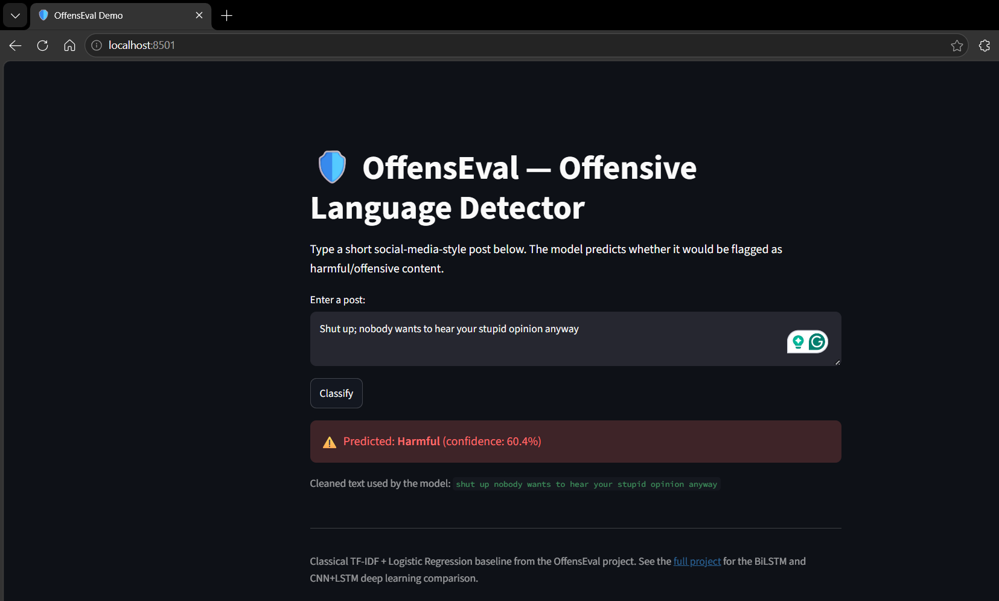
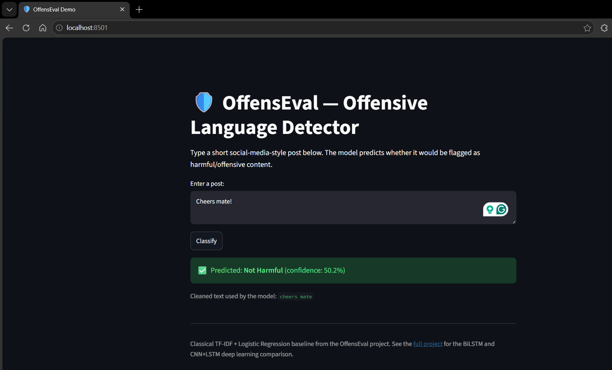

# OffensEval: Detecting Offensive Language in Social Media Posts

Binary classification of social media posts as **harmful / not-harmful**, comparing classical
machine learning baselines against deep learning sequence models on a ~4,000-post OffensEval-style
dataset.

This project explores whether lightweight deep learning architectures (BiLSTM, CNN+LSTM) can
outperform classical TF-IDF baselines on a small, imbalanced dataset of short, noisy,
informal text — without relying on large pretrained transformers.

## Key finding

A **CNN+LSTM hybrid model using bigram-enhanced sequences** was the strongest model overall,
outperforming both the classical TF-IDF baselines and a unigram-only BiLSTM — showing that,
on short informal text, short-phrase (bigram) context matters more than model depth alone.

## Results

| Model                          | Accuracy | Macro F1 | AUC   | Notes                              |
|--------------------------------|:--------:|:--------:|:-----:|-------------------------------------|
| Logistic Regression (TF-IDF)   | 0.709    | 0.69     | –     | Baseline, unigram+bigram TF-IDF     |
| Random Forest (TF-IDF)         | 0.723    | 0.69     | –     | class-weighted                      |
| Random Forest (GridSearchCV)   | 0.711    | 0.69     | –     | Tuned, no gain over untuned RF      |
| BiLSTM (unigram sequences)     | 0.680    | –        | 0.767 | Weaker recall on the harmful class  |
| **CNN+LSTM (bigram sequences)**| **0.750**| –        | **0.827** | Best overall performance        |

Full classification reports, confusion matrices, and ROC curves are in
[`results/`](results/) and in the two notebooks under [`notebooks/`](notebooks/).

## Why this dataset is hard

- Only ~4,000 labelled posts, with class imbalance (~67% harmful / 33% not-harmful)
- Short, informal social media text: slang, emojis, sarcasm, non-standard grammar
- Harmful intent is often carried by short phrases ("shut up", "go away") that unigram
  models cannot capture — this motivated the bigram-based CNN+LSTM approach

## Project structure

```
OffensEval/
├── data/                     # TBO_4k_train.xlsx (raw labelled dataset)
├── notebooks/
│   ├── 01_classical_ml.ipynb     # TF-IDF + Logistic Regression / Random Forest
│   └── 02_deep_learning.ipynb    # BiLSTM and CNN+LSTM models
├── src/
│   ├── preprocessing.py      # Text cleaning + tokenization utilities
│   ├── train_classical.py    # Trains & evaluates the TF-IDF baselines
│   ├── train_deep.py         # Trains & evaluates BiLSTM / CNN+LSTM
│   └── evaluate.py           # Shared evaluation + plotting helpers
├── app/
│   └── app.py                # Streamlit demo — try the classifier live
├── results/                  # Saved confusion matrices, ROC curves, metrics
├── requirements.txt
└── README.md
```

## Setup

```bash
git clone https://github.com/shanmukhacharan/OffensEval.git
cd OffensEval
pip install -r requirements.txt
```

## Usage

Train the classical baselines:
```bash
python src/train_classical.py
```

Train the deep learning models:
```bash
python src/train_deep.py
```

Try the live demo:
```bash
streamlit run app/app.py

### Demo screenshots

**Correctly flagged as harmful:**


**Uncertain / borderline case** — a neutral post the model is unsure about (60% confidence),
illustrating a real limitation of the classical baseline on a small, imbalanced dataset:

```

Or explore the two notebooks in `notebooks/` for the full walkthrough with visualizations.

## Dataset

`TBO_4k_train.xlsx` — ~4,000 social media posts, each annotated for whether the post contains
harmful/offensive content (`T1 Harmful`: YES/NO), along with the offense target and argument
spans (used for a more fine-grained task not explored in this project).

## Method summary

1. **Preprocessing**: lowercasing, removing user mentions/URLs/hashtags, stripping non-alphabetic
   characters, deduplication.
2. **Classical baselines**: TF-IDF (unigram + bigram, 5,000 features) → Logistic Regression and
   Random Forest, with `class_weight='balanced'` to handle imbalance, and a GridSearchCV sweep
   over Random Forest hyperparameters.
3. **Deep learning models**:
   - **BiLSTM** trained on unigram token sequences
   - **CNN+LSTM hybrid** trained on bigram-enhanced sequences, using convolutional filters to
     capture short local phrase patterns before the LSTM layer
   - Both trained with class-weighting to handle the imbalance, evaluated with accuracy,
     precision/recall per class, and ROC-AUC

## Limitations & ethical considerations

- Small dataset (~4k posts) limits generalization; results should be read as a comparative study,
  not a production-ready classifier.
- Offensive-language datasets are known in the literature to disproportionately flag posts written
  in African-American Vernacular English (AAVE) and other dialects as offensive — a bias risk this
  project has not specifically audited for, and one any deployment of this kind of model should
  address before real-world use.
- The dataset only covers English-language posts from a single platform and time period.

## Possible extensions

- Fine-tune a lightweight transformer (e.g. DistilBERT) as a fourth comparison point
- Error analysis with concrete misclassified examples
- Address dialect/bias risk with a fairness-aware evaluation split

## Author

Adabala Sri Satya Sai Shanmukha Charan — MSc Data Science
